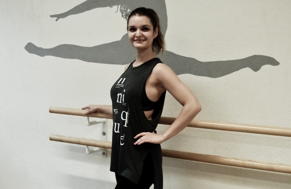

## About Us
- [@dangchimasoud](https://www.github.com/dangchimasoud) (Masoud Dangchi)
- [@bauscha](https://www.github.com/bauscha) (Andreas Bausch)
- [@monasobh](https://www.github.com/monasobh) (Mona Sobhani)

# Business Description

a.) The name of our business is: Salsa Swings Dance Studio

b.) Location of business (headquarters):\
Salsa Swings Dance Studio GmbH\
Karl-Marx-Straße 69,\
1010 Vienna, Austria

c.) Contact information:\
E-Mail: info@salsa-swings.at\
Phone number: +41 148 2830 1191\
Facebook: fb.com/salsa_swings_dance_studio\
Instragram: instagram.com/salsa_swings_dance_studio\
TikTok: tiktok.com/@salsa_swings_dance_studio\
Youtube: youtube.com/c/salsa_swings_dance_studio

d.) Description for "About" page (our mission):\
Our goal is to pass on the knowledge we have gained over the last ten years in the dance field and as dance teachers to the next generation and thus contribute to a strong dance culture in Vienna. We not only teach movements, but also focus on togetherness. In addition to training dance knowledge, coordination, tact, motor skills and fitness, we focus on social values such as a sense of community and building self-confidence. We want to offer our members a place where they feel comfortable, grow dance-wise, make friends and simply have fun.

e.) The product is a website providing information about different dance courses and the available timeslots for them. The website allows to directly contact the dance teachers for each course. The user can see the timeslots for courses, information about membership and pricing.

f.) Personas:
|  | Professional Dance Teacher     | Dance student                |
| :-------- | :------- | :------------------------- |
| `Photo` |  |  |
| `Fictional Name` | Javier Michelo | Swenja Polacho |
| `Demographics` | 35 years old, married, recently became first child, has masters degree in Dance and Dance Choreopgraphy | 23 years old, single, studying Sociology as Master, working part time job |
| `Goals and tasks` | His goal is to teach students how to dance different standard dances. He is a professional dancer and takes part in different dance competitions as well as in dance shows. His task is to provide dance lessons and be part of a dance studio team. | Her goal is to become a good dancer in ballet besides finishing her masters degree in sociology. Her tasks are writing the master thesis and attending dance lessons with her ballet partners for practising for a small ballet competition. |
| `Environment` | In his daily day Javier is in the dance studio teaching classes mostly in the evening for students. He enjoys his passion and is thankful that he is able to do that as his job. | Swenja has a busy schedule during her week. Without her calendar she would be lost. Scheduling her week is very important to her and meetings with friends as well. |
| `Quote` | “Feeling the rythm frees the soul” | “Reach for the stars” |

g.) Other relevant info:\
The members should be able to listen to the currently used soundtracks in the courses to be able to practise at home. They should also be able to watch dance introduction videos on the website.
We are aware that we are not supposed to create interacting websites - thats why for implementing we thought to tell our client to create dummy pages (e.g. Login for Dance Teachers). 

Sources:\
Photo for Persona Javier Michelo: http://s572452030.website-start.de/\
Photo for Swenja Polacho: https://jvdance.ch/wp-content/uploads/2016/05/P5120947-600x390.jpg\
Logo created with: adobe\

# Next header

# Next header
